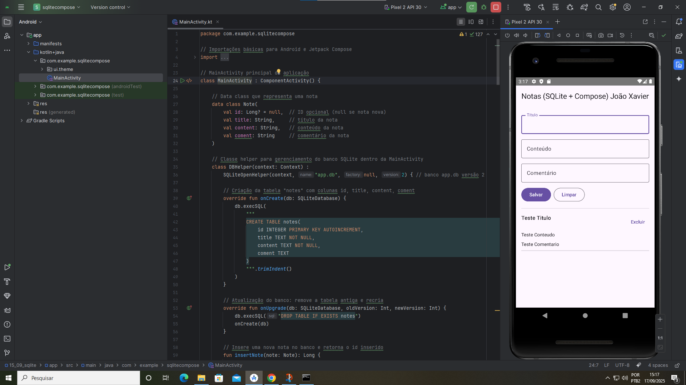

#  Projeto: Gerenciador de Notas (SQLite + Jetpack Compose) 📝

## Descrição:
Este é um aplicativo móvel desenvolvido para gerenciar notas, que permite aos usuários criar, ler, atualizar e excluir anotações. O app oferece uma experiência de usuário fluida e moderna ao combinar SQLite para persistência de dados local com Jetpack Compose para a construção da interface.

## Tecnologias Utilizadas:

- Kotlin: A principal linguagem de programação utilizada para a lógica do aplicativo.

- Jetpack Compose: Um toolkit de UI declarativa para Android que simplifica o desenvolvimento da interface, tornando-o mais rápido e intuitivo.

- SQLite: Um sistema de banco de dados relacional leve e integrado ao Android, usado para armazenar as notas diretamente no dispositivo do usuário.

- Android Studio: O ambiente de desenvolvimento integrado (IDE) oficial para construir e depurar o app.

## Principais Funcionalidades:

- Operações CRUD: O aplicativo implementa a funcionalidade completa de Criar, Ler, Atualizar e Excluir (CRUD) para o gerenciamento de notas.

- Integração com Banco de Dados: Demonstra como interagir com um banco de dados SQLite de forma estruturada, usando a classe `SQLiteOpenHelper` para gerenciar a criação, a versão e as consultas.

- UI Dinâmica: A lista de notas é construída com um `LazyColumn`, um componente altamente eficiente que renderiza apenas os itens visíveis, garantindo um desempenho suave mesmo com muitas anotações.

- Gerenciamento de Estado: O app utiliza os recursos de gerenciamento de estado do Compose (`mutableStateOf`, `remember`) para lidar com a entrada do usuário e atualizar a interface automaticamente quando os dados mudam.

## Print da Execução do Código

